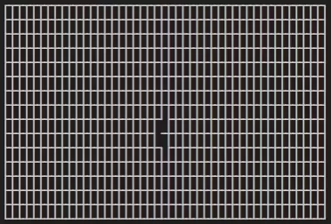
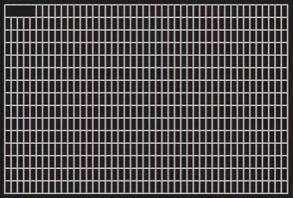
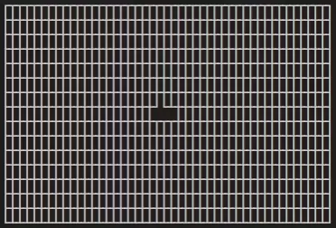
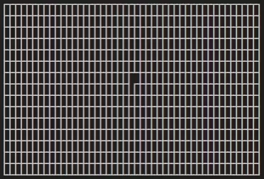
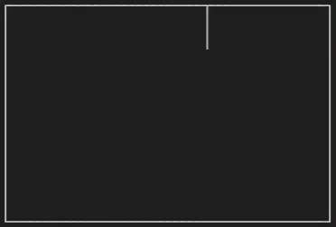

# MazeGenerator

A collection of algorithms for generating mazes, while visualizing them.

## Demos

Here is a demonstration of mazes being generated with the various algorithms.

### Randomized Depth First Search `--dfs`

  
[Wikipedia](https://en.wikipedia.org/wiki/Maze_generation_algorithm#Randomized_depth-first_search)  
[Code](./src/map.rs#L151)

### Random Binary Tree Maze `--tree`

  
[Wikipedia](https://en.wikipedia.org/wiki/Maze_generation_algorithm#Simple_algorithms)  
[Code](./src/map.rs#L188)

### Randomized Prim's algorithm `--prim`

  
[Wikipedia](https://en.wikipedia.org/wiki/Maze_generation_algorithm#Randomized_Prim's_algorithm)  
[Code](./src/map.rs#L222)

### The Aldous-Broder algorithm `--ab`

  
[Wikipedia](https://en.wikipedia.org/wiki/Maze_generation_algorithm#Aldous-Broder_algorithm)  
[Code](./src/map.rs#L253)

### Recursive Division Method `--div`

  
[Wikipedia](https://en.wikipedia.org/wiki/Maze_generation_algorithm#Recursive_division_method)  
[Code](./src/map.rs#L287)

### Wilson's algorithm `--wilson`

  
[Wikipedia](https://en.wikipedia.org/wiki/Maze_generation_algorithm#Wilson's_algorithm)  
[Code](./src/map.rs#L360)

## Usage

```
USAGE:
    maze_generator [FLAGS] [OPTIONS]

FLAGS:
        --dfs      Use the depth first search algorithm for maze generation [default]
        --tree     Use the binary tree maze algorithm for maze generation
        --prim     Use Prim's algorithm for maze generation
        --ab       Use the Aldous-Broder algorithm for maze generation
        --div      Use the recursive division method for maze generation
        --wilson   Use Wilson's algorithm (loop-erased random walk) for maze generation
    -h, --help     Prints help information

OPTIONS:
        --rows <ROWS>                  Number of rows of the generated map [default: 5]
        --columns <COLUMNS>            Number of columns of the generated map [default: 5]
        --start_row <START_ROW>        The row to start generating from [default: 0]
        --start_column <START_COLUMN>  The column to start generating from [default: 0]
        --delay <DELAY>                The ms delay between steps [default: 50]
```

## Development

This project is developed in Rust and uses Cargo.

During development you will most likely want to use
```
> cargo run
```
if you want to send arguments to the program, preface them with an "empty"
double dash
```
> cargo run -- <arguments here>
```

For publication use
```
> cargo build --release
```
the resulting binary will be placed in `./target/release`.
